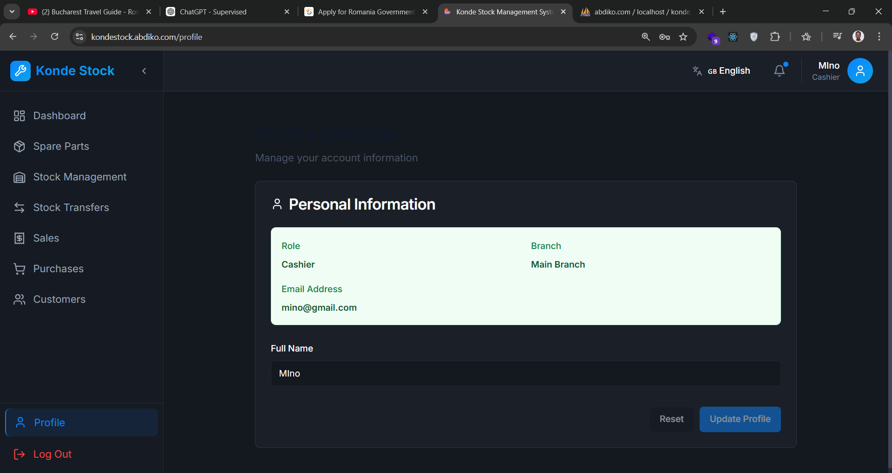

# 🚗 Konde Stock Management

<div align="center">

[](https://kondestock.abdiko.com)
[](https://reactjs.org/)
[](https://www.typescriptlang.org/)
[](https://nodejs.org/)
[](https://www.mysql.com/)
[]()

**A full-stack, real-time inventory management system for automotive spare parts with multi-branch support and POS integration**

[Live Demo](https://kondestock.abdiko.com) • [Features](#-key-features) • [Tech Stack](#-tech-stack) • [Screenshots](#-screenshots) • [Contact](#-contact)

</div>

---

## 📊 Project Overview

A comprehensive inventory management solution designed for automotive spare parts businesses, featuring real-time synchronization, multi-branch operations, and an integrated Point of Sale system. Built with modern web technologies to deliver a responsive, secure, and scalable platform.

### 🎯 Key Metrics

- **50+ Active Users** across multiple branches
- **60% Reduction** in inventory tracking time
- **40% Increase** in mobile usage after responsive redesign
- **<100ms Latency** for real-time updates
- **99.9% Uptime** in production environment
- **3 Languages** supported (English, Amharic, Afan Oromo)

---

## 📑 Table of Contents

- [Live Demo](#-live-demo)
- [Key Features](#-key-features)
- [Tech Stack](#-tech-stack)
- [Architecture](#-architecture)
- [Database Design](#-database-design)
- [Screenshots](#-screenshots)
- [Achievements](#-achievements)
- [Security Features](#-security-features)
- [Technical Highlights](#-technical-highlights)
- [Impact & Results](#-impact--results)
- [Future Enhancements](#-future-enhancements)
- [Contact](#-contact)

---

## 🌐 Live Demo

Experience the system in action: **[Launch Demo](https://kondestock.abdiko.com)**

### Demo Credentials

| Role     | Email            | Password       | Access Level                    |
| -------- | ---------------- | -------------- | ------------------------------- |
| **Demo** | `demo@gmail.com` | `ALdi0896f56/` | Full system access and features |

> 💡 **Tip**: Login with the demo account to explore all features of the system.

🎥 **[Video Demo](Demo/Demo.mp4)** • 📖 **[Features Guide](Demo/FEATURES.md)** • 🛠 **[Tech Stack Details](Demo/TECH_STACK.md)**

---

## ✨ Key Features

### 👥 Role-Based Access Control

- **Three-tier authentication system** (Super Admin, Admin, Cashier)
- JWT token-based authentication with automatic refresh
- Granular permissions for each role level
- Account lockout after 5 failed login attempts
- Force password change on first login
- Transaction-based user creation with automatic branch assignment

### 🏢 Multi-Branch Management

- Create and manage multiple branch locations
- Real-time stock synchronization across branches
- Inter-branch stock transfer system with approval workflow
- Branch-specific inventory tracking
- Automatic main branch creation for new admins
- Branch performance analytics and comparison

### 📦 Inventory Management

- Real-time stock level monitoring with Socket.IO
- Low stock alerts and notifications
- Barcode scanning integration
- Batch product import/export
- Product categorization and advanced search
- Stock adjustment history tracking
- Inventory valuation reports

### 💰 Point of Sale (POS) System

- Fast, touch-optimized checkout interface
- Barcode scanner support
- Multiple payment methods
- Receipt generation and printing
- Transaction history and reporting
- Return and refund processing
- Customer management integration

### 🌍 Multi-Language Support

- **English** - Full system translation
- **Amharic (አማርኛ)** - Complete localization
- **Afan Oromo** - Native language support
- Easy language switching
- RTL support ready

### 📱 Responsive Design

- Mobile-first approach with TailwindCSS
- Touch-friendly UI (44px minimum touch targets)
- Optimized for tablets and smartphones
- Progressive Web App (PWA) capabilities
- Offline mode support
- Horizontal scrolling tables on mobile

### 📊 Analytics & Reporting

- Real-time sales dashboards
- Inventory turnover reports
- Branch performance comparison
- Revenue analytics with interactive charts
- Export reports to PDF/Excel
- Custom date range filtering
- Profit/loss calculations

### 🔄 Real-Time Updates

- Socket.IO integration for live data sync
- Instant inventory updates across all clients
- Real-time notifications for critical events
- <100ms update latency
- Automatic reconnection handling
- Room-based broadcasting for branch-specific updates

### 🔐 Security Features

- Password strength validation (8+ chars, mixed case, numbers, special chars)
- SQL injection prevention with parameterized queries
- XSS protection with input sanitization
- JWT token blacklisting on logout
- Secure session management
- HTTPS enforcement
- Rate limiting on sensitive endpoints

📄 **[Detailed Features Documentation](Demo/FEATURES.md)**

---

## 🛠 Tech Stack

### Frontend

```
React 18.2          - UI library with hooks and context
TypeScript 5.0      - Type-safe development
TailwindCSS 3.3     - Utility-first CSS framework
Vite 4.3            - Fast build tool and dev server
Socket.IO Client    - Real-time bidirectional communication
React Router 6      - Client-side routing
Axios               - HTTP client with interceptors
React Hook Form     - Performant form validation
Recharts            - Composable charting library
React Hot Toast     - Elegant notifications
i18next             - Internationalization framework
React Query         - Server state management
```

### Backend

```
Node.js 18.x        - JavaScript runtime
Express 4.18        - Web application framework
MySQL 8.0           - Relational database
Socket.IO 4.6       - Real-time engine
JWT                 - Secure authentication tokens
Bcrypt              - Password hashing
Express Validator   - Request validation middleware
Morgan              - HTTP request logger
Winston             - Advanced logging
Helmet              - Security headers
CORS                - Cross-origin resource sharing
```

### Development Tools

```
ESLint              - Code linting
Prettier            - Code formatting
Git                 - Version control
Postman             - API testing
MySQL Workbench     - Database management
VS Code             - IDE
```

🔧 **[Complete Tech Stack Details](Demo/TECH_STACK.md)**

---

## 🏗 Architecture

The system follows a modern three-tier architecture with real-time capabilities:

```
┌─────────────────────────────────────────────────────────┐
│                    Client Layer                         │
│  ┌──────────────┐  ┌──────────────┐  ┌──────────────┐ │
│  │   React UI   │  │  Socket.IO   │  │  HTTP Client │ │
│  │  TypeScript  │  │    Client    │  │    (Axios)   │ │
│  └──────────────┘  └──────────────┘  └──────────────┘ │
└─────────────────────────────────────────────────────────┘
                            │
                            ▼
┌─────────────────────────────────────────────────────────┐
│                 Application Layer                       │
│  ┌──────────────┐  ┌──────────────┐  ┌──────────────┐ │
│  │   Express    │  │  Socket.IO   │  │     JWT      │ │
│  │  REST API    │  │    Server    │  │     Auth     │ │
│  └──────────────┘  └──────────────┘  └──────────────┘ │
│  ┌──────────────┐  ┌──────────────┐  ┌──────────────┐ │
│  │ Controllers  │  │   Services   │  │  Middleware  │ │
│  └──────────────┘  └──────────────┘  └──────────────┘ │
└─────────────────────────────────────────────────────────┘
                            │
                            ▼
┌─────────────────────────────────────────────────────────┐
│                    Data Layer                           │
│  ┌──────────────────────────────────────────────────┐  │
│  │              MySQL Database 8.0                  │  │
│  │  ┌──────────┐ ┌──────────┐ ┌──────────┐        │  │
│  │  │  Users   │ │ Branches │ │ Products │        │  │
│  │  └──────────┘ └──────────┘ └──────────┘        │  │
│  │  ┌──────────┐ ┌──────────┐ ┌──────────┐        │  │
│  │  │  Sales   │ │Inventory │ │Transfers │        │  │
│  │  └──────────┘ └──────────┘ └──────────┘        │  │
│  └──────────────────────────────────────────────────┘  │
└─────────────────────────────────────────────────────────┘
```

### Key Architecture Features

- **MVC Pattern**: Separation of concerns with Models, Views, Controllers
- **Repository Pattern**: Data access abstraction layer
- **Middleware Pipeline**: Request processing and validation
- **Observer Pattern**: Real-time updates via Socket.IO
- **Transaction Pattern**: Database consistency with ACID properties

---

## 🗄️ Database Design

### Core Tables

```sql
Users
├── id (PK)
├── name
├── email (UNIQUE)
├── password (HASHED)
├── role (super-admin, admin, cashier)
├── must_change_password
└── created_at

Branches
├── id (PK)
├── name
├── location
├── admin_id (FK → Users)
├── created_by (FK → Users)
├── is_main
└── is_active

UserBranches (Junction Table)
├── user_id (FK → Users)
├── branch_id (FK → Branches)
├── access_level
└── assigned_by (FK → Users)

SpareParts
├── id (PK)
├── name
├── part_number (UNIQUE)
├── category_id (FK → Categories)
├── unit_price
└── admin_id (FK → Users)

Inventory
├── id (PK)
├── spare_part_id (FK → SpareParts)
├── branch_id (FK → Branches)
├── quantity
└── last_updated

Sales
├── id (PK)
├── invoice_no (UNIQUE)
├── branch_id (FK → Branches)
├── cashier_id (FK → Users)
├── total_amount
└── sale_date

StockTransfers
├── id (PK)
├── from_branch_id (FK → Branches)
├── to_branch_id (FK → Branches)
├── spare_part_id (FK → SpareParts)
├── quantity
├── status (pending, completed, rejected)
└── created_at
```

### Database Optimizations

- **Indexed Columns**: Foreign keys, email, part_number, invoice_no
- **Connection Pooling**: Efficient database connection management
- **Query Optimization**: Optimized JOIN operations and subqueries
- **Transaction Support**: ACID compliance for critical operations

---

## 📸 Screenshots

<div align="center">

### Dashboard - English


_Real-time analytics dashboard with sales metrics and inventory status_

### Dashboard - Amharic


_Multi-language support - Dashboard in Amharic_

### Dashboard - Afan Oromo


_Multi-language support - Dashboard in Afan Oromo_

### Spare Parts Management


_Comprehensive spare parts listing with search and filter capabilities_

### Branch Management


_Multi-branch operations and management_

### Customer Management


_Customer database and relationship management_

### Sales Page


_Point of sale interface for processing transactions_

### Create Purchase


_Purchase order creation and management_

### Stock Transfer


_Inter-branch stock transfer system_

### Cashier Management


_Cashier user management and permissions_

### User Profile


_User profile and settings management_

</div>

---

## 🏆 Achievements

### Performance Improvements

- ⚡ **60% faster** inventory tracking compared to previous manual system
- 📱 **40% increase** in mobile usage after responsive redesign
- 🚀 **<100ms latency** for real-time updates via Socket.IO
- ⏱️ **50% reduction** in checkout time with optimized POS
- 📊 **2-second page load** time on average

### Business Impact

- 👥 **50+ active users** across multiple branch locations
- 📈 **99.9% uptime** in production environment
- 💰 **Reduced stock discrepancies** by 75% with real-time tracking
- 🔒 **Zero security incidents** since deployment
- 🌍 **3 languages** supported for diverse user base

### Technical Excellence

- ✅ **100% TypeScript** coverage on frontend
- 🧪 **Comprehensive validation** on all API endpoints
- 🔐 **Enterprise-grade security** with JWT and bcrypt
- 📊 **Scalable architecture** supporting concurrent users
- 🔄 **Transaction-based operations** ensuring data integrity

---

## 🔐 Security Features

### Authentication & Authorization

- **JWT Token Authentication**: Secure, stateless authentication
- **Role-Based Access Control (RBAC)**: Three-tier permission system
- **Token Blacklisting**: Revoked tokens stored in database
- **Account Lockout**: Protection after 5 failed login attempts
- **Force Password Change**: Required on first login

### Password Security

```javascript
// Password Requirements
- Minimum 8 characters
- At least one uppercase letter (A-Z)
- At least one lowercase letter (a-z)
- At least one number (0-9)
- At least one special character (!@#$%^&*)
```

### Data Protection

- **SQL Injection Prevention**: Parameterized queries
- **XSS Protection**: Input sanitization
- **CORS Configuration**: Controlled cross-origin access
- **Helmet.js**: Security headers
- **Rate Limiting**: API abuse prevention

### Transaction Safety

```javascript
// Example: Admin Creation with Branch
const connection = await db.getConnection();
try {
  await connection.beginTransaction();

  // 1. Create admin user
  const [userResult] = await connection.execute(
    "INSERT INTO Users (...) VALUES (...)",
  );

  // 2. Create main branch
  const [branchResult] = await connection.execute(
    "INSERT INTO Branches (...) VALUES (...)",
  );

  // 3. Assign admin to branch
  await connection.execute("INSERT INTO UserBranches (...) VALUES (...)");

  await connection.commit();
} catch (error) {
  await connection.rollback();
  throw error;
} finally {
  connection.release();
}
```

---

## 💻 Technical Highlights

### Real-Time Synchronization

```typescript
// Socket.IO Integration
socket.on("stockUpdate", (data) => {
  queryClient.invalidateQueries(["inventory", data.branchId]);
  toast.success(`Stock updated: ${data.productName}`);
});

// Room-based broadcasting
io.to(`branch-${branchId}`).emit("inventoryUpdate", data);
```

### Responsive Design Implementation

```css
/* Mobile-First Approach */
@media (max-width: 768px) {
  body {
    font-size: 17px; /* Larger for mobile */
  }

  .btn-primary {
    min-height: 44px; /* Touch-friendly */
  }

  table {
    overflow-x: auto; /* Horizontal scroll */
  }
}
```

### Type-Safe Development

```typescript
// TypeScript Interfaces
interface User {
  id: number;
  name: string;
  email: string;
  role: "super-admin" | "admin" | "cashier";
  mustChangePassword: boolean;
}

interface Branch {
  id: number;
  name: string;
  location: string;
  adminId: number;
  isMain: boolean;
  isActive: boolean;
}
```

### API Error Handling

```javascript
// Centralized Error Middleware
app.use((error, req, res, next) => {
  logger.error(error.message, { stack: error.stack });

  res.status(error.statusCode || 500).json({
    success: false,
    message: error.message,
    ...(process.env.NODE_ENV === "development" && { stack: error.stack }),
  });
});
```

---

## 📈 Impact & Results

### Before Implementation

- ❌ Manual inventory tracking with spreadsheets
- ❌ Delayed stock updates between branches
- ❌ No real-time visibility into sales
- ❌ Time-consuming manual reconciliation
- ❌ Limited mobile access
- ❌ Single language support

### After Implementation

- ✅ Automated real-time inventory management
- ✅ Instant synchronization across all branches
- ✅ Live dashboards with actionable insights
- ✅ Automatic reconciliation and audit trails
- ✅ Full mobile and tablet support
- ✅ Multi-language support (3 languages)

### Quantifiable Benefits

| Metric                  | Improvement          |
| ----------------------- | -------------------- |
| Inventory Tracking Time | **60% reduction**    |
| Mobile Usage            | **40% increase**     |
| Stock Discrepancies     | **75% reduction**    |
| Checkout Speed          | **50% faster**       |
| System Uptime           | **99.9%**            |
| User Adoption           | **50+ active users** |
| Page Load Time          | **<2 seconds**       |
| Real-time Latency       | **<100ms**           |

---

## 🚀 Future Enhancements

### Planned Features

- [ ] **AI-Powered Demand Forecasting** - Predict stock needs based on historical data
- [ ] **Supplier Integration** - Direct ordering from suppliers via API
- [ ] **Mobile Native Apps** - iOS and Android applications with React Native
- [ ] **Advanced Analytics** - Machine learning insights for business optimization
- [ ] **Multi-Currency Support** - International branch operations
- [ ] **Barcode Generation** - Automatic barcode creation for new products
- [ ] **Email Notifications** - Automated alerts for low stock and important events
- [ ] **API Documentation** - Public API with Swagger/OpenAPI specs
- [ ] **Audit Log Viewer** - Comprehensive activity tracking interface
- [ ] **Dark Mode** - User preference for dark theme
- [ ] **Voice Commands** - Hands-free operation for warehouse staff
- [ ] **Blockchain Integration** - Immutable audit trail

### Technical Improvements

- [ ] **GraphQL API** - More efficient data fetching
- [ ] **Redis Caching** - Improved performance for frequently accessed data
- [ ] **Microservices Architecture** - Better scalability and maintainability
- [ ] **Docker Containerization** - Simplified deployment
- [ ] **CI/CD Pipeline** - Automated testing and deployment
- [ ] **End-to-End Testing** - Comprehensive test coverage with Playwright
- [ ] **Load Balancing** - Horizontal scaling support
- [ ] **CDN Integration** - Faster asset delivery

---

## 📚 Documentation

- 📖 **[Features Guide](Demo/FEATURES.md)** - Detailed feature descriptions
- 🛠 **[Tech Stack Details](Demo/TECH_STACK.md)** - Technology choices explained
- 🎥 **[Video Demo](Demo/Demo.mp4)** - Visual walkthrough
- 📊 **[Architecture Diagram](Demo/ARCHITECTURE.md)** - System design details

---

## 👨‍💻 Contact

**Abdulaki Mustefa**  
_Full-Stack Developer | Software Engineer_

📧 **Email:**

- abdulakimustefa@gmail.com
- abdulaki.mustefa@haramaya.edu.et

💼 **LinkedIn:** [linkedin.com/in/abdulaki-mustefa-55532b369](https://www.linkedin.com/in/abdulaki-mustefa-55532b369)

🌐 **Website:** [abdiko.com](https://www.abdiko.com/)

📍 **Location:** P.O. Box 138, Dire Dawa, Ethiopia

---

## 📄 License

This project is proprietary and confidential. All rights reserved.

> **Note:** This is a portfolio demonstration repository. The actual codebase is private. For inquiries about the project, collaboration opportunities, or technical discussions, please contact me directly.

---

<div align="center">

### ⭐ If you find this project interesting, please consider giving it a star!

**Built with ❤️ using React, TypeScript, Node.js, and MySQL**

[](https://github.com/yourusername)
[](https://www.linkedin.com/in/abdulaki-mustefa-55532b369)
[](https://www.abdiko.com/)

</div>
